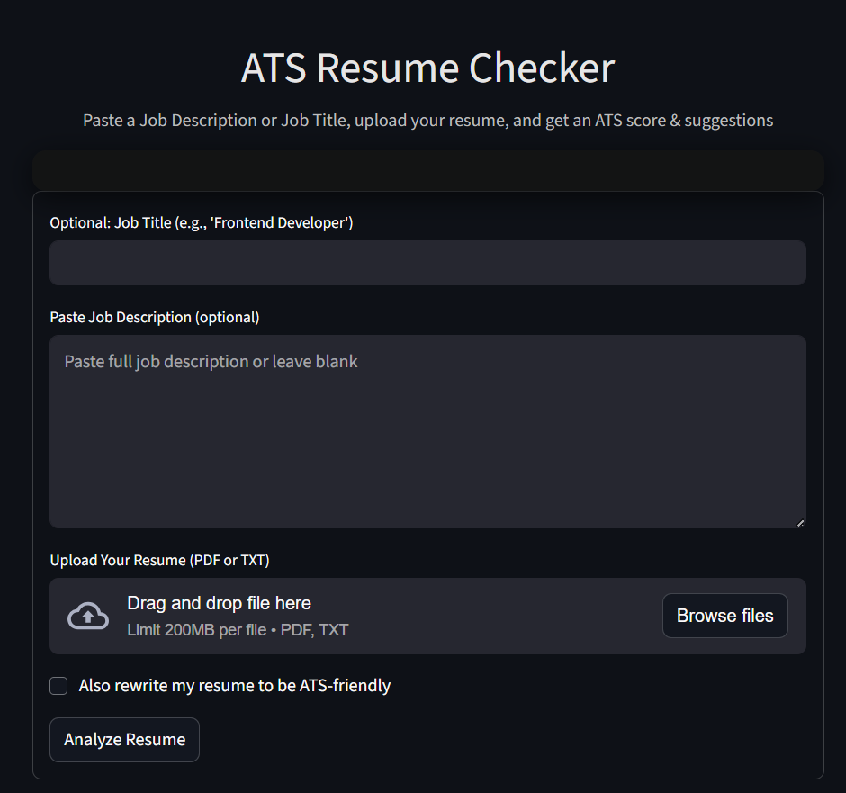

# 📄 ATS Resume Checker

An **ATS (Applicant Tracking System) Resume Checker** built with **Streamlit** and **Google Gemini API**.  
This tool allows you to **upload your resume** in PDF format and compare it with a given job description to get a **similarity score** and **feedback** to improve your chances of passing ATS filters.

---

## 🚀 Features
- 📂 **Upload Resume** (PDF format)
- 📜 **Paste Job Description**
- 🤖 **AI-powered Analysis** using Google Gemini API
- 📊 **Similarity Score** using TF-IDF and Cosine Similarity
- 💡 **Improvement Suggestions** for better ATS compliance
- 🎨 **Modern UI** with custom CSS and animations

---

## 🛠️ Technologies Used
- **Python**
- **Streamlit**
- **PyPDF2** – for extracting text from PDFs
- **Google Generative AI (Gemini API)**
- **Scikit-learn** – for TF-IDF and cosine similarity
- **dotenv** – for environment variable management

---

## Screenshots
###Homepage


---

## 📦 Installation

1️⃣ **Clone the repository**
```bash
git clone https://github.com/your-username/ats-resume-checker.git
cd ats-resume-checker
---
2️⃣ Create a virtual environment

bash
Copy
Edit
python -m venv venv
source venv/bin/activate   # On macOS/Linux
venv\Scripts\activate      # On Windows
---
3️⃣ Install dependencies

bash
Copy
Edit
pip install -r requirements.txt
---
4️⃣ Set up your environment variables

Create a .env file in the project root

Add your Google API Key:

env
Copy
Edit
GOOGLE_API_KEY=your_google_api_key_here

▶️ Usage
Run the Streamlit app:

bash
Copy
Edit
streamlit run app.py
The app will open in your browser at:

arduino
Copy
Edit
http://localhost:8501

---

 How It Works
Upload your resume in PDF format.

Paste the job description.

The system extracts text from the resume and job description.

TF-IDF Vectorizer + Cosine Similarity calculates a similarity score.

Google Gemini API generates custom improvement suggestions.

The results are displayed with a clean, modern Streamlit UI.

📜 License
This project is licensed under the MIT License.

🤝 Contributing
Pull requests are welcome! For major changes, open an issue first to discuss your ideas.

